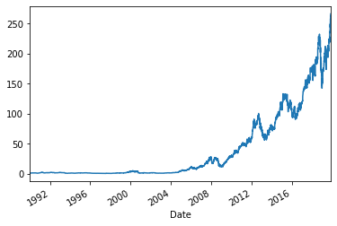
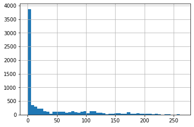
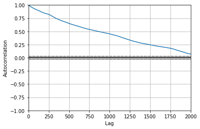
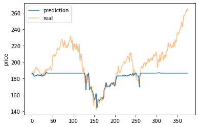
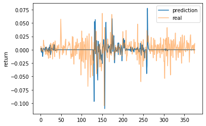
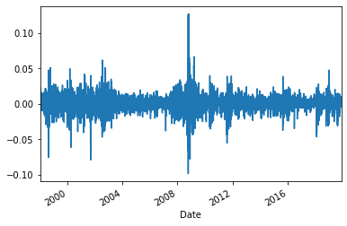
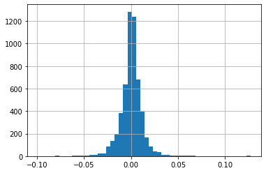

# stock_price_by_historical
A python pipeline of using models from sklearn and tensorflow to predict (classification or regression) stock price by its historical price.
Import the package.


```python
import stock_model
```

Apply stock_model class to a variable.


```python
template = stock_model.stock_model()
```

Report parameters and get explaination.


```python
template.para()
```

    ticker: SPY
    start: 1990-01-01
    end: 2019-11-15
    task_type: classification
    target: return
    model_type: sk
    model_name: rf
    test_size: 0.05
    lag: 50
    ta: False
    normalization: True
    drift_include: False
    commission: 0.0
    


```python
template.para_explain()
```

    ticker: ticker of the asset, default SPY
    start: start time of data, default 1990-01-01
    end: end time of data, default 2019-11-15
    task_type: task type, either classification or regression, default classification
    target: target feature of modeling, default return
    model_type: whether model in sklearn or tensorflow, default sk, can change to tf
    model_name: abbreviated name of the model, default rf
    test_size: split proportion of the test set, default 0.3
    lag: time lag to consider for the model, default 50
    ta: whether to add technical tickers for the data, default False
    normalization: whether apply normalization for the data, default True
    drift_include: whether to include drift for r2_base score , default False
    commission: commission for testing trading strategy return, default 0.01 in percentage
    


```python
template.para_explain(['ticker','lag'])
```

    ticker: ticker of the asset, default SPY
    lag: time lag to consider for the model, default 50
    

Change parameters.


```python
template.ticker = 'aapl'
```


```python
template.para_change({'ticker':'aapl','task_type':'reg','target':'return','normalization':False})
```


```python
template.para()
```

    ticker: aapl
    start: 1990-01-01
    end: 2019-11-15
    task_type: reg
    target: return
    model_type: sk
    model_name: rf
    test_size: 0.05
    lag: 50
    ta: False
    normalization: False
    drift_include: False
    commission: 0.0
    

Getting and processing the data.


```python
template.target = 'price'
template.data_prepare()
```

    [*********************100%***********************]  1 of 1 completed
    

Descriptive analysis of the data.


```python
template.plot_all(lag = 2000, ran = 1)
```











```python
template.analyze_raw()
```


<div>
<style scoped>
    .dataframe tbody tr th:only-of-type {
        vertical-align: middle;
    }

    .dataframe tbody tr th {
        vertical-align: top;
    }

    .dataframe thead th {
        text-align: right;
    }
</style>
<table border="1" class="dataframe">
  <thead>
    <tr style="text-align: right;">
      <th></th>
      <th>ticker</th>
      <th>start</th>
      <th>end</th>
      <th>days</th>
      <th>low</th>
      <th>high</th>
      <th>now</th>
      <th>annual_return</th>
      <th>total_return</th>
    </tr>
  </thead>
  <tbody>
    <tr>
      <td>0</td>
      <td>aapl</td>
      <td>1990-01-03 00:00:00</td>
      <td>2019-11-15 00:00:00</td>
      <td>7528</td>
      <td>0.462054</td>
      <td>265.76</td>
      <td>265.76</td>
      <td>0.193219</td>
      <td>195.823</td>
    </tr>
  </tbody>
</table>
</div>


Build the model.


```python
template.model_build_sk(model_para='')
```

Train the model.


```python
template.model_train_sk()
```

    c:\users\zfan2\anaconda3\envs\tf_gpu\lib\site-packages\sklearn\ensemble\forest.py:245: FutureWarning: The default value of n_estimators will change from 10 in version 0.20 to 100 in 0.22.
      "10 in version 0.20 to 100 in 0.22.", FutureWarning)
    

Evaluate the model.


```python
template.score_analyze()
```


<div>
<style scoped>
    .dataframe tbody tr th:only-of-type {
        vertical-align: middle;
    }

    .dataframe tbody tr th {
        vertical-align: top;
    }

    .dataframe thead th {
        text-align: right;
    }
</style>
<table border="1" class="dataframe">
  <thead>
    <tr style="text-align: right;">
      <th></th>
      <th>ticker</th>
      <th>model_name</th>
      <th>score</th>
      <th>accuracy</th>
      <th>r2</th>
      <th>r2_base</th>
      <th>realized_total_return</th>
      <th>total_return</th>
      <th>annual_return</th>
    </tr>
  </thead>
  <tbody>
    <tr>
      <td>0</td>
      <td>aapl</td>
      <td>rf</td>
      <td>-0.105788</td>
      <td>0.550532</td>
      <td>-6.60203</td>
      <td>0.979166</td>
      <td>0.413617</td>
      <td>0.264583</td>
      <td>0.16989</td>
    </tr>
  </tbody>
</table>
</div>


Plot the model prediction.


```python
template.score_plot_prediction()
template.score_plot_return()
```








Quick Version


```python
import stock_model
template = stock_model.stock_model()
template.para_change({'ticker':'dia','task_type':'classification','target':'price','model_name':'ridge','model_type':'sk'})
template.para()
```

    ticker: dia
    start: 1990-01-01
    end: 2019-11-15
    task_type: classification
    target: price
    model_type: sk
    model_name: ridge
    test_size: 0.05
    lag: 50
    ta: False
    normalization: True
    drift_include: False
    commission: 0.0
    


```python
template.data_prepare()
template.plot_all()
```

    [*********************100%***********************]  1 of 1 completed
    








```python
template.model_build_sk(model_para='')
template.model_train_sk()
template.score_analyze()
```


    ---------------------------------------------------------------------------

    UnboundLocalError                         Traceback (most recent call last)

    <ipython-input-18-6b1eb1f76742> in <module>
    ----> 1 template.model_build_sk(model_para='')
          2 template.model_train_sk()
          3 template.score_analyze()
    

    ~\Columbia University\Deep Learning Homework\stock_model.py in model_build_sk(self, model_para)
        698 
        699     def model_build_sk(self, model_para = ''):
    --> 700         self.model = model_build_sk(self.model_name, task_type = self.task_type, model_para = model_para)
        701 
        702     def model_build_tf(self, number_layer = 3, width = 50, number_drop_out = 0.2, optimizer = 'adam'):
    

    ~\Columbia University\Deep Learning Homework\stock_model.py in model_build_sk(model_name_string, task_type, model_para)
        214             model = eval('Ridge(' + model_para +')')
        215 
    --> 216     return model
        217 
        218 def model_build_mlp(x_train, task_type = 'classification', number_layer = 3, width = 50, number_drop_out = 0.2, optimizer = 'adam'):
    

    UnboundLocalError: local variable 'model' referenced before assignment


```python
template.score_plot_prediction()
template.score_plot_return()
```
